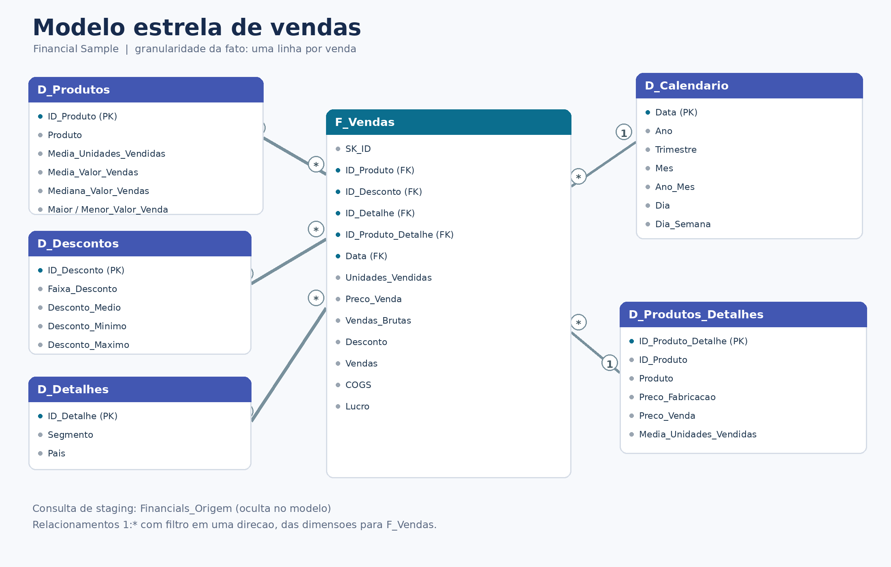

# Modelagem e transformação de dados com DAX

Projeto desenvolvido para o desafio da DIO de modelagem e transformação de dados com DAX no Power BI. A tabela única Financial Sample foi transformada em um modelo estrela com uma tabela fato, cinco dimensões, uma consulta de staging oculta e medidas explícitas para análise financeira.

## Modelo estrela



O centro do modelo é `F_Vendas`, com uma linha por venda. As dimensões filtram a fato em relacionamentos `1:*` e direção única:

- `D_Produtos`: cadastro e estatísticas por produto.
- `D_Produtos_Detalhes`: combinação de produto e preços.
- `D_Descontos`: faixas e estatísticas de descontos.
- `D_Detalhes`: combinação de segmento e país.
- `D_Calendario`: calendário contínuo criado em DAX com `CALENDAR`.

`Financials_Origem` fica oculta e funciona como backup e staging. Ela preserva os dados originais usados pelas consultas derivadas.

## Transformações realizadas

1. Importação da tabela `financials` e limpeza dos nomes de colunas.
2. Substituição da faixa de desconto nula por `None`.
3. Definição dos tipos de texto, inteiro, data e moeda.
4. Criação de `D_Produtos` por agrupamento, com média, mediana, máximo e mínimo.
5. Criação condicional do índice de produtos: Carretera 0, Montana 1, Paseo 2, Velo 3, VTT 4 e Amarilla 5.
6. Criação das demais dimensões com granularidades únicas e chaves inteiras.
7. Criação de `F_Vendas`, inclusão de `SK_ID`, junção com as dimensões e reorganização das colunas.
8. Criação de `D_Calendario` em DAX e configuração da hierarquia Ano > Trimestre > Mês > Dia.

## DAX

O modelo inclui medidas para vendas, lucro, descontos, COGS, unidades, quantidade de vendas, margem, ticket médio, vendas do ano anterior, crescimento anual e lucro acumulado no ano. As fórmulas estão em scripts/dax/D_Calendario.dax → D_Calendario.dax , e a tabela calendário está em [`scripts/dax/D_Calendario.dax`](scripts/dax/D_Calendario.dax).

## Como abrir

Abra `Projeto_Financials.pbip` no Power BI Desktop. O projeto é autocontido: os dados foram incorporados à consulta `Financials_Origem`, portanto não é necessário corrigir um caminho de arquivo para a primeira atualização. Para gerar o PBIX solicitado na entrega, siga docs/como_gerar_pbix.md → como_gerar_pbix.md.

## Estrutura do repositório

```text
Projeto_Financials.pbip
Projeto_Financials.Report/
Projeto_Financials.SemanticModel/
data/Financial_Sample.xlsx
docs/
scripts/dax/
scripts/power_query/
```

## Validação

A amostra contém 700 vendas, 6 produtos, 4 faixas de desconto e datas de setembro de 2013 a dezembro de 2014. Os totais esperados estão em docs/validacao_dados.md → validacao_dados.md.

## Referências

- [Enunciado do desafio da DIO](https://hermes.dio.me/files/assets/f11bb55a-ab79-4e73-8fd7-e35bb72d751d.docx)
- [Financial Sample da Microsoft](https://learn.microsoft.com/en-us/power-bi/create-reports/sample-financial-download)
- [Orientações de esquema estrela no Power BI](https://learn.microsoft.com/en-us/power-bi/guidance/star-schema)
- [Função DAX CALENDAR](https://learn.microsoft.com/en-us/dax/calendar-function-dax)
- [Power BI Project PBIP](https://learn.microsoft.com/en-us/power-bi/developer/projects/projects-overview)

## Autoria

Nicole Lopes
